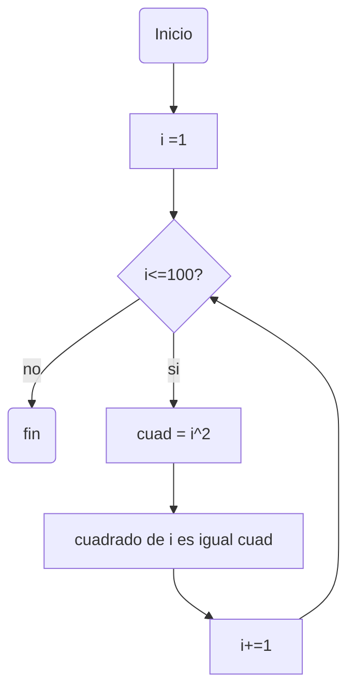
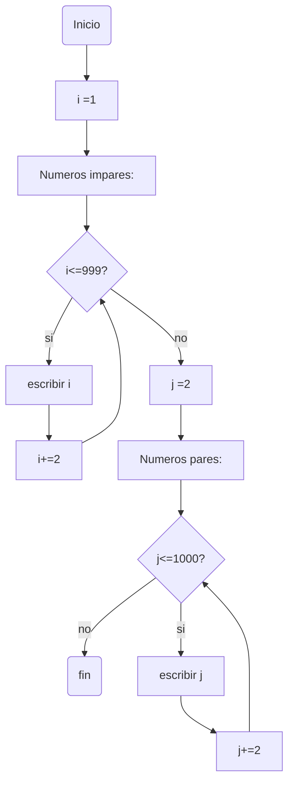
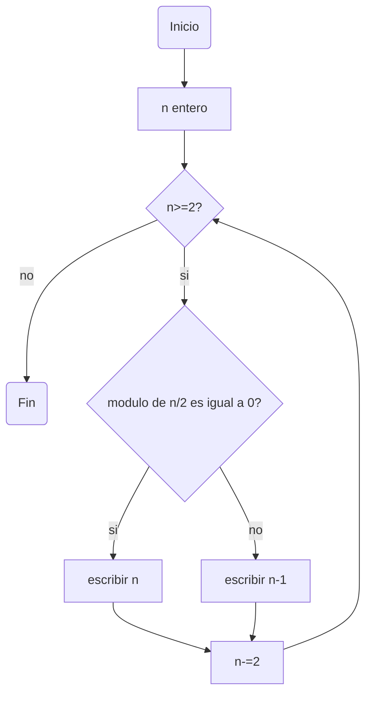

# Reto_7
>#### 1.Imprimir un listado con los números del 1 al 100 cada uno con su respectivo cuadrado.

Codigo:
```python
i : int = 1  # Desde que numero se va a imprimir
while i<=100: # Se repite el ciclo hasta que llegemos al ultimo numero (100)
  cuadrado : int = i**2 # La variable cuadrado se asigna al cuadrado del numero
  print("numero: "+ str(i) + ", "+ "cuadrado: " + str(cuadrado) ) # Se imprime el numero y su cuadrado
  i+=1   # Suma 1 al numero 
```
>#### 2.Imprimir un listado con los números impares desde 1 hasta 999 y seguidamente otro listado con los números pares desde 2 hasta 1000.

Codigo:
```python
i : int = 1 # Se empieza desde el primer impar: 1
print ("Numeos impares: ")
while i<=999 :  # Se repite el ciclo mientras que se el numero sea menor o igual a 999
  print(i) # Se imprime el numero 
  i+=2   # Se suma de a 2 ya que impar + 2= impar siguiente
print("Numeros pares: ")
i = 2  # Se empieza desde 2
while i<=1000 : # Se repite el ciclo mientras que se el numero sea menor o igual a 1000       
  print(i)  # Se imprime el numero
  i+=2  # Se suma de a 2 ya que par + 2= par siguiente
```

>#### 3.Imprimir los números pares en forma descendente hasta 2 que son menores o iguales a un número natural n ≥ 2 dado


Codigo:

```python
n : int = int(input("Numero  n>=2: ")) # El usuario ingresa un numero mayor o igual que 2
while n>=2 : # Se repite el ciclo mientras quue el numero sea mayor o igual a 2
  if n%2 == 0 : # Si el numero es par se imprime si mismo
    print(n) 
  else : # Si el numero es impar se le resta uno para volverse par e imprimirse
    print(n-1)
  n-=2  # Se resta 2 al numero ya que par-2 = par anterior
```
>#### 4.En 2022 el país A tendrá una población de 25 millones de habitantes y el país B de 18.9 millones. Las tasas de crecimiento anual de la población serán de 2% y 3% respectivamente. Desarrollar un algoritmo para informar en que año la población del país B superará a la de A.
```python
Poblacion_A_en_millones : float = 25   # Poblacion inicial de pais A
Poblacion_B_en_millones : float = 18.9 # Poblacion inicial de pais B
Año = 2022  # Año de inicio
while Poblacion_A_en_millones>Poblacion_B_en_millones: # Se repite el ciclo hasta que la poblacion del pais B supere la poblacion del pais A 
  Poblacion_A_en_millones += 0.02 # Se aumenta la poblacion por la tasa de crecimiento del pais A
  Poblacion_B_en_millones += 0.03 # Se aumenta la poblacion por la tasa de crecimiento del pais B
  if Poblacion_A_en_millones<Poblacion_B_en_millones:  # Si la poblacion del pais B supera la del pais A se rompe el ciclo
    break
  Año +=1 # Se aumenta el año por 1
print("La población del país B superará a la de A en: " + str(Año)) # Se imprime en que año la poblacion del pais B supero la del pais A
```
>#### 5.Imprimir el factorial de un número natural n dado.
```python
n: int = int(input("Ingrese numero natural: ")) #Se ingresa el numero para dar el factorial
N=n # Se guarda el valor inicial en el valor N
Factorial : int = 1 # El factorial se empieza por 1
while n >= 1 : # Se repite el ciclo mientras que el numero sea mayor o igual a 1 
  Factorial *= n	# El factorial se multiplica por el numero
  n-=1 # El numero se resta por uno y se repite el ciclo
print("El factorial de " +str(N)+" es "+str(Factorial))  # Se imprime el numero y su factorial 
```
>#### 6.Implementar un algoritmo que permita adivinar un número dado de 1 a 100, preguntando en cada caso si el número es mayor, menor o igual.
```python
a : float = float(input("Ingrese numero:")) # El usuario ingresa un numero para adivinar 
b : float = 36.0 # El numero que el usuario debe adivinar
while a!=b : # Se repite el ciclo mientras que los numeros sean distintos
  if b>a: # Si el numero que se debe adivinar es mayor, se imprime que el numero es mayor
    print("El numero es mayor")
    a = float(input("Adivine de nuevo:")) # El usuario vuelve a adivinar
  else :
    print("El numero es menor") # Si el numero que se debe adivinar es menor, se imprime que el numero es menor
    a = float(input("Adivine de nuevo:")) # El usuario vuelve a adivinar
if a == b: # Si los numeros son iguales, se imprime los numeros son iguales
  print("Los numeros son iguales") 
```
>#### 7.Implementar un programa que ingrese un número de 2 a 50 y muestre sus divisores.
```python
n : int = int(input("Ingrese numero de 2 a 50: ")) # El usuario ingresa un numero  
divs : int = 1 # Se empieza el divisor desde 1, ya que el divisible mas pequeño que un numero puede tener  
while n>=2 and n<=50: # Si el numero esta entre 2 y 50 entra al ciclo
  if n%divs == 0 : # Se imprime el divisor si el modulo es igual a 0
    print(str(divs) + " es divisor de " + str(n))   
  divs +=1 # Se suma 1 al posible divisor
  if divs >= n : # Se finaliza el ciclo si el divisor es igual a el numero, ya que es el ultimo divisor posible
    break
```
>#### 8.Implementar el algoritmo que muestre los números primos del 1 al 100. Nota: use funciones
```python
def calculo_primo(n:int)->int: 
  j:int =2 # Se declarar e inicializa la variable j desde 2, ya que es el divisible mas pequeño que un numero puede tener sin contar 1
  primo_si: bool = True # Se inicializa la variable como Verdadera
  while j<n: # Se repite el ciclo mientras el posible divisor sea menor a el numero 
    if n%j == 0: # Si el modulo del numero y el divisor es igual a 0 tiene otro divisor ademas 1 y si mismo, entonces no es primo
      primo_si = False  # Se inicializa a Falso ya que no es primo
      break # Se rompe el ciclo ya que solo basta un divisor para no ser primo
    j+=1 # se suma 1 a j en cada paso
  if n == 1: # si el numero es 1, no es primmo 
    primo_si= False 
  if primo_si == True : # Si nunca se cambio a falso se imprime que el numero es primo
    print(str(n) + " es primo") 

i: int =1  # Desde que numero se van a imprimir los primos
x: int =100 # Hasta que numero se van a imprimir los primos
while i<=x: # Se repite el ciclo hasta que se llegue al limite superior
  calculo_primo(i) # Se comprueba si es primo para un numero
  i+=1  # Se suma 1 al limite inferior
```
